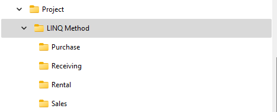

# Deliverable 1 - **Transactional Service Methods**

This deliverable requires that you create working solutions for your transactional service methods using Linqpad. Complete the implementation of your scenario/subsystem service method(s). Test the service method(s). Your service method(s) are to be coded in separate Linqpad Program environment file(s), one for each scenario. Please speak to your instructor on this.

> ***NOTE:*** Compiler errors that prevent the project from loading may be treated as an automatic mark of zero for this section.

Be sure to develop your solution in small increments, making frequent commits and referencing your issue numbers from GitHub.

Document any and all bugs in an issue attached to the appropriate milestone for your scenario.

Your Linqpad solution should:

1. contain user friendly error handling 
1. a query(ies) displaying the data manipulated by the service method transaction
1. Main method used as the driver for testing
1. services in their own appropriate method

**An example on how to reused your view models can be found here** <a href="Examples/Calling%20ViewModel%20From%20LINQ/Readme.md" target="_blank">Reusing View Models</a>

 

**Use the information provided by your instructor.** You may discover things in the "in depth documents" that maybe missing or enhance.

### Project Layout

----

*Back to the [General Instructions](./README.md)*
