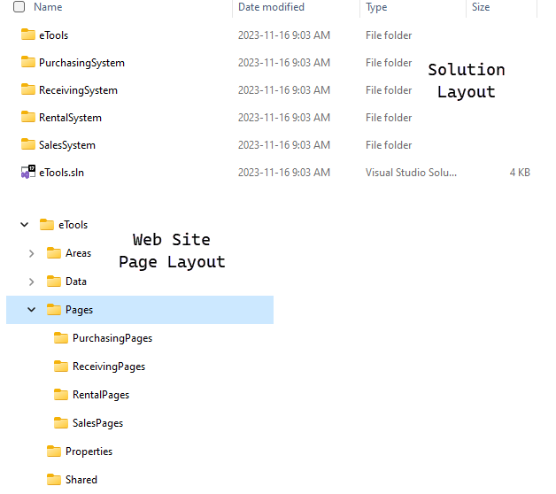

# Deliverable 2 - **Final Solution**

# **Group Work**

## **Project Setup and Security**

There are three stages to accomplishing the setup of your solution.

1. **Project Setup**
1. **Security Setup**
1. **Scenario Subsystem Setup**

The first two stages are to be completed by different team members. **Use GitHub issues** to delegate specific tasks for those stages among your team members; divide up the tasks as equitably as possible.

For the third stage, each team member must set up a class library for their selected scenario.

**Each** member **must** demonstrate their participation in the project setup by making small, meaningful commits. When performing commits of your code, be sure to reference the issue number in your commit so that your work can be easily distinguished by your instructor.

## Stage 1 - Project Setup

Using the techniques and practices demonstrated in class, set up the repository project files by generating the following items.

- [ ] **Repository Documentation**
  - Ensure the **`ReadMe.md`** file at the root of your repository has the following:
    - Team Name for the project
    - Group Logo
    - Team member names mapped to each person's chosen subsystem
- [ ] **Web Application Project**
  - *This should be the first project in the solution, so that it opens as the default startup project.*
  - Use **individual accounts** for the authentication when setting up the project
    - **NOT REQUIRED.**  If you have setup your project already using individual accounts, there are no issues if you do not use it.
  - Use styling system (such as [Holiday-CSS](https://holidaycss.js.org/)) for a consistent look & feel
  - Home page for the site must include the following
    - Group Logo
    - Team member names with their Scenario/Subsystem
  - Subfolders for each scenario to organize the pages related to each scenario. Ensure there is a *default page* for each subfolder. Use this default page to document bugs and problems for the scenario.
  - Site layout must include working navigation to default pages for each subsystem as well as the team name.
  - Add project references to the class libraries when **Stage 3** is complete
  - Configure **services** and [**user secrets**](https://docs.microsoft.com/en-us/aspnet/core/security/app-secrets?view=aspnetcore-5.0&tabs=windows) (e.g.: *connection string* values) for each subsystem when **Stage 3** is complete
    - Document the names and purposes of the **user secrets** in the `ReadMe.md` at the root of the repository

## Stage 2 - Security Setup

# NOT USED FOR DELIVERABLE 2

## Stage 3 - Subsystem Setup

Each team member must create a **class library project** for their subsystem. In that library, reverse engineer the database including only the tables relevant for your scenario. Ensure the generated Entity and DbContext classes are changed from being `public` to being **`internal`**.

----

# Individual Work

***DO NOT start this section until you have the group work completed as you will be working in your own class libraries and within your own web page folder.***

## Scenario Implementation

Complete the implementation of your scenario/subsystem. 

> ***NOTE:*** Compiler errors that prevent the project from loading may be treated as an automatic mark of zero for this section.

Be sure to develop your solution in small increments, making frequent commits and referencing your issue numbers from GitHub.

Document any and all bugs in your subsystem on the default page for your scenario.

*Back to the [General Instructions](./README.md)*
