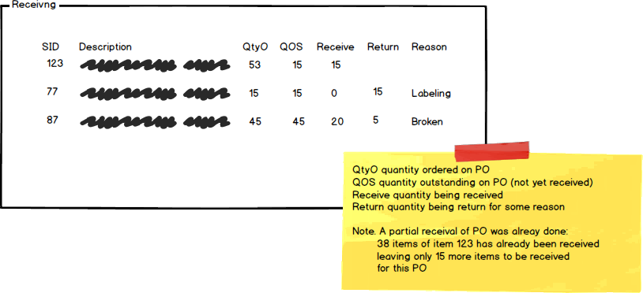
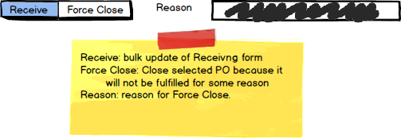
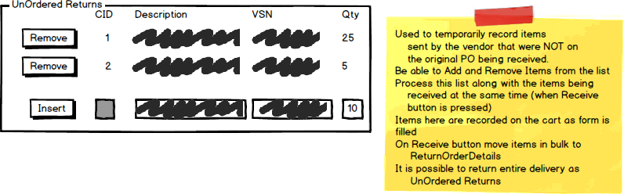

# Receiving Purchase Orders

## Business Process Overview

> *Employees must log onto the system. Receiving must only allow authenicated users within the Receiving Role to have access to the subsystem. An Associate or Department Head do receiving. The Employee full name must appear on the form in text mode*

Receiving purchased merchandise for resale is done usually days to weeks after the purchase order was originally placed. An outstanding purchase order has **not** been closed and has an order date. Receiving involves the manual verification of items shipped to us by the vendor against the shipping sheet. The receiver records on the shipping sheet the quantity of items received, damaged items, or items that have been sent, by accident, which were not actually on the purchase order. The shipping sheet can then be manual compared to our purchase order on file.

To start the process, all outstanding orders are displayed to the receiver. From this list the receiver will select the order that is being received. On selecting an order, the order details are displayed. This will allow the receiver to manually verify the order contents to the shipping sheet. As the receiver verifies the order, the receiver may:

- Enter the number of stock items received
- Enter the number of stock items refused and returned, a reason must be entered
- Enter items for return that are not on the original order (shipped in error).

Once the receiver has finished verifying the order and making the necessary receiving entries on the screen, a button is pressed to process the data. The data currently displayed on the screen is sent for **bulk** processing by the system.

A receiver can also Force Close an order (this is a management decision). A Force Close is used when the outstanding order will not be full-filled by the supplier for one reason or another, such as the supplier has gone out of business or the product is no longer available or produced. A Force Close order must have a reason supplied.

After either Receiving or Force Close, refresh the display so a new order can be selected from the outstanding list of orders.

## Requirements

Business Rules and Form Processing

- Only one order is received at a time
- Only outstanding orders are displayed and can be selected for processing
  - Order not Closed
  - Order date present
- Display the following for outstanding orders:
  - Order PO id 
  - Order Date
  - Vendor Name
  - Vendor Contact Phone
- Allow the receiver to select an order from the outstanding order display.
- When the order is retreived display:
  - Vendor Name
  - Vendor Contact Phone
  - Purchase Order Details (for each detail)
    - Display
      - StockItemID
      - StockItem Description
      - Quantity On Order (PO detail)
      - Quantity Outstanding (amount of produce yet to be received)
    - Entry
      - Received Quantity
      - Returned Quantity
      - Return Reason
- Receiver will enter Receive and/or Return Quantities
- Receiver will enter a reason for any return quantity
- Receiver will process Unordered Purchase Items by:
  - An unordered purchase item is a vendor stockitem sent but was not part of the purchase order.
  - Receiver will enter Decription, VendorPartNumber and Quantity.
  - Records will be collected into a **temporary** cart for processing with the rest of the received items.
  - Cart collected records for this receiving session will be displayed in a list as they are entered into the cart.
  - This temporary cart is emptied for each receive process, data exists only for the current receiving process.
- Control Command Button
  - View Order will retrieve and display the associated order information and order details
- Form Process Buttons
  - Receive will do a bulk update processing of the current displayed purchase order
    - A ReceiveOrder Entry is made
    - A ReceiveOrderDetail entry is made for each stockitem received, indicating quantity received
    - The StockItem QuantityOnHand is adjusted (increased) by the amount received
    - The StockItem QunatityOnOrder is adjusted (descreased) by the amount received
    - A ReturnOrderDetail entry is made for each stockitem returned, indicating the quantity returned and the reason
    - A ReturnOrderDetail entry is made for each vendor item in the unordered purchase cart, indicating the description, quantity returned, reason (not ordered), and the vendor part number. After which, **empty the cart**.
    - The order is checked to see if it can be closed (no outstanding items). If the order is complete, close the order.
  - Force close will
    - update the PurchaseOrder to Closed and record the reason in the Notes
    - update the StockItem entries of the PurchaseOrderDetail stockitems, subtracting any outstanding amount for the QuantityOnOrder.
  - Insert/Remove UnOrdered Item list
    - Insert will add an unpurchased vendor item to the unordered purchase item cart.
    - Remove will remove an unpurchased vendor item from the unordered purchase item cart.
  

----

*Back to the [General Instructions](./../README.md)*