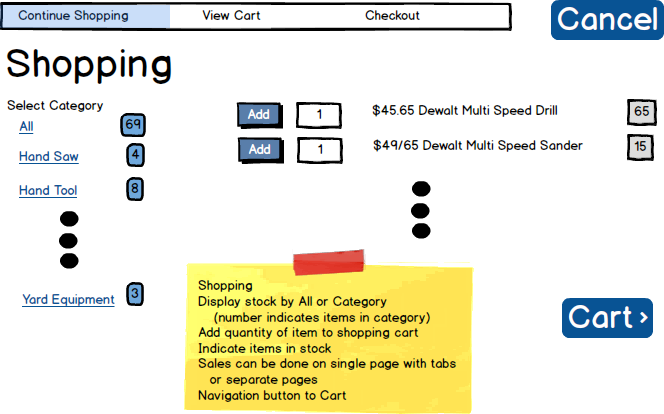
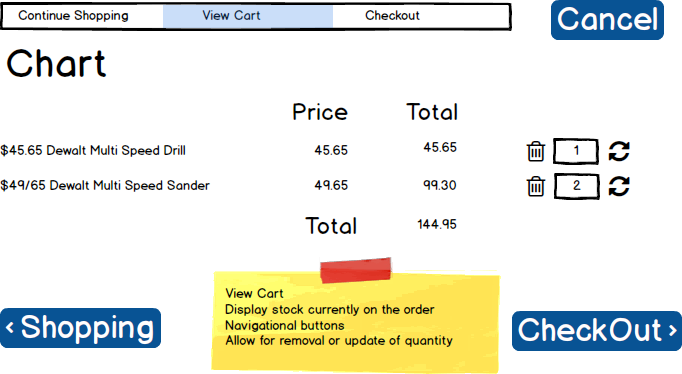
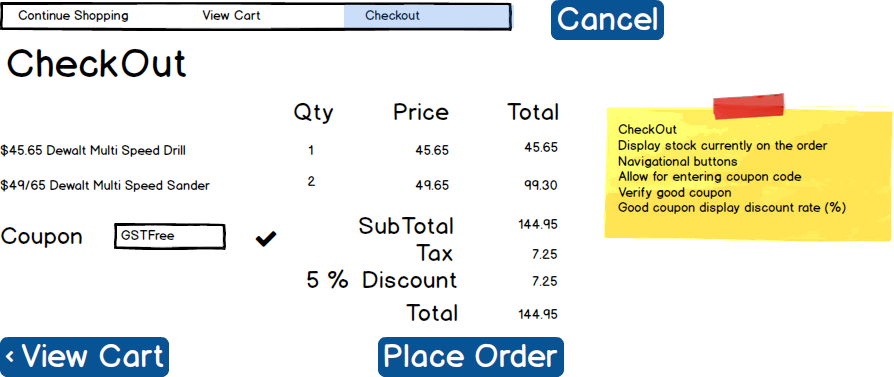
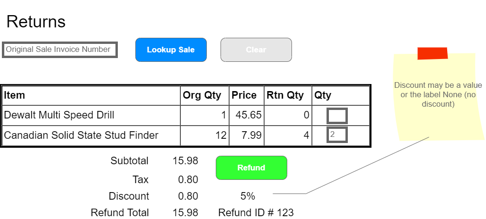
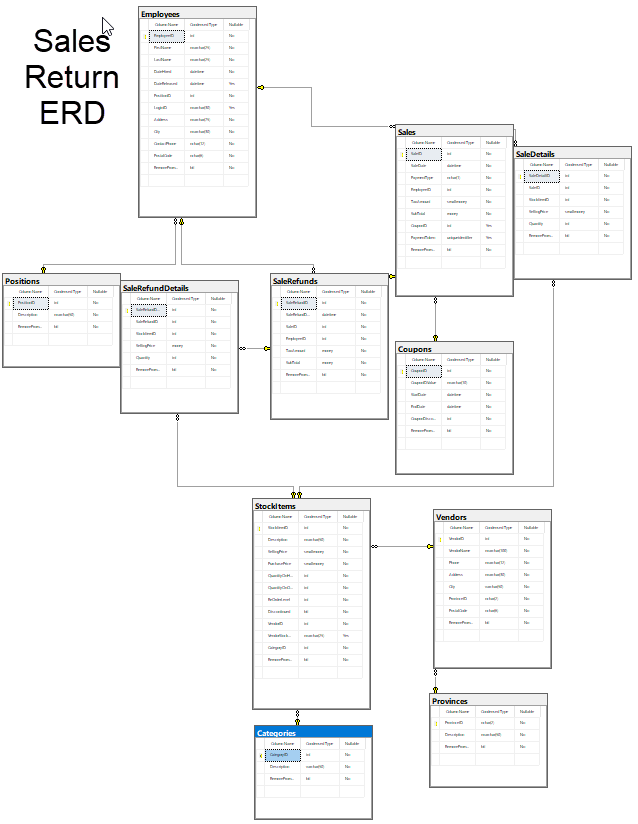

# Sales

## Business Process Overview

> *The Sales and Returns component assigned to you is for supporting in store events only. Employees must log onto the system. Sales and Returns must only allow authenicated users within the SalesReturns Role to have access to the subsystem. An Associate or Store Manager handle sales and/or returns. The Employee full name must appear on the form in text mode*

## Sales

The Sales subsystem handles all in-store sales of products as well as refunds. 

### In-Store Shopping

Customers bring products to the counter for in-store purchases and the employee records each item in a sales cart dedicated to the employee's till. Items can be added and removed from the sales cart and the quantities can be edited in the sales cart; refresh the item subtotals when the refresh icon is clicked (). The Sales component is shown here in three steps. Shopping, viewing the cart and placing the sale. **(You may combine all 3 views into one for your design. Overall functionality must be maintained.)** When the customer pays, the employee clicks the **Place Order** button and the entire sales cart is updated and processed as a completed sale. A Cancel button must be present on all time to cancel the current shopping process the employee is handling. 

#### Business Rules and Form Processing

The following rules should be considered in the behavior of in-store sales.

- A sale is allowed to have only **one** shopping cart (but as many items in the cart as they want). 
- Duplicate items in the cart is not allowed. 
- Changing of item quantities must be done in View Chart or do an automatic increment when Add from Shopping.
- Discontinued products should not be shown and cannot be added to the cart.
- The quantity (which must be a whole number greater than zero) must be supplied when clicking Add
- Quantity next to Add defaults to 1
- Added products are added to the shopping cart items
- Employees continue shopping after adding an item, but a message is shown confirming that the item has been added to the cart
    - [Optional] The **View Cart** link should also include a number of the distinct items in the cart.

----

### Checkout

The Checkout process is done in two phases:

#### Business Rules and Form Processing

- View Cart
  - List the current items in the employee's shopping cart
  - Employee can change quantities and/or remove items from the cart
  - Add a Continue Shopping button that navigates them to the shopping view.
  - Add a CheckOut button that will navigate to the next phase, CheckingOut.
  
- Place Order
  - Box to enter a coupon & apply to the pricing of the order
  - Payment types are 'M', 'C', or 'D', for 'Money', 'Credit' and 'Debit', respectively
  - Subtotal, GST, Discount (is a calculated percentage ie: 10%), and Total
  - Place Order button. Placing the order is done as a complete transaction on the server (a single context.SaveChanges()). In this transaction, you must do the following:
    - Create a sale and sale items based on all the information in the shopping cart.
    - Reduce the stock on hand based on the quantities of the items purchased. Ensure that the stock item quantity on hand will not go negative. Throw an exception if this will happen.
    - Display the sales id.
    - Items cannot be added or edited after the payment is processed.

## Refunds/Returns

Customer may bring items back for a refund, provided that they show their original receipt and that they give a reason for each item refunded. 

Use the following rules when processing returns.

- Refunds require the original receipt number (SaleID) in order to be processed.
- A successful refund results in a SalesRefund record and at least one SalesRefundDetail record being generated.
- Individual item refunds are allowed. Partial item refunds are allowed. You may not return more item quantity then were sold on the original sale for particular item.
- The refunded price is the price on the original sale.
- If a discount was applied to the original sale then the discount applies to the total funds returned to the purchaser.
- The refund process is to happen as a single complete transaction.
  - The refund results are to remain on the screen after the refund is complete. Show the Sale Refund number of the refund.
  - The refund cannot be edited after it has been processed.
  - In-stock inventory quantities need to be updated with all refunds, but the product itself is set aside for later inspection by a manager (who may return it to the supplier in a separate process).

- Clicking the **Clear** button clears the screen

----

----

*Back to the [General Instructions](./../README.md)*